# ADR-0001: Initial Architecture

## Status
Accepted

## Date
{{date}}

## Context
We need to establish the initial architecture for {{app_name}}.

## Decision
We will use a **layered architecture** with the following structure:

```mermaid
graph TB
    subgraph "Layers"
        API[API Layer<br/>Controllers, DTOs]
        BIZ[Business Layer<br/>Services, Domain]
        DATA[Data Layer<br/>Repositories, Entities]
    end
    
    API --> BIZ
    BIZ --> DATA
    
    style API fill:#e94560,color:#fff
    style BIZ fill:#16213e
    style DATA fill:#0f3460
```

### Key Decisions:
1. **Spring Boot** as the application framework
2. **Spring Data JPA** for data access
3. **PostgreSQL** as the primary database
4. **Docker** for containerization
5. **REST API** with OpenAPI documentation

## Consequences

### Positive
- Clear separation of concerns
- Easy to test each layer independently
- Well-understood patterns by team

### Negative
- Potential for anemic domain model
- Layer coupling if not careful

### Risks
- Need to enforce layer boundaries in code reviews

## References
- [Spring Boot Documentation](https://spring.io/projects/spring-boot)
- [Clean Architecture](https://blog.cleancoder.com/uncle-bob/2012/08/13/the-clean-architecture.html)
