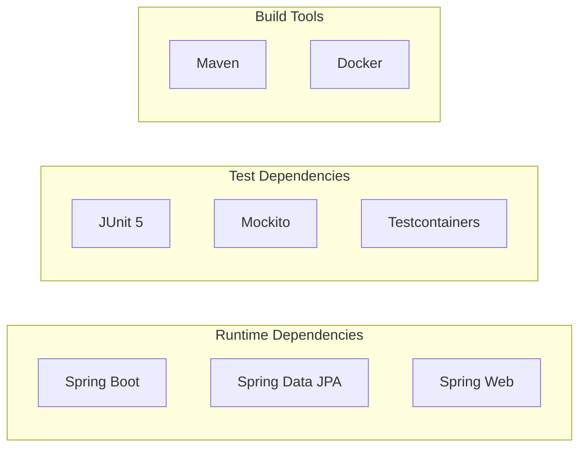

# Development View

The Development View describes the system's organization from a developer's perspective: modules, components, and build structure.

## Component Diagram

```mermaid
graph TB
    subgraph "{{app_name}}"
        subgraph "API Module"
            REST[REST Controllers]
            SEC[Security Filter]
        end
        
        subgraph "Core Module"
            BIZ[Business Services]
            VAL[Validators]
        end
        
        subgraph "Data Module"
            REPO[Repositories]
            ENT[Entities]
        end
        
        subgraph "Common Module"
            UTIL[Utilities]
            EXC[Exception Handling]
        end
    end
    
    REST --> BIZ
    REST --> SEC
    BIZ --> REPO
    BIZ --> VAL
    REPO --> ENT
    REST --> EXC
    BIZ --> UTIL
    
    style REST fill:#e94560,color:#fff
    style BIZ fill:#16213e
    style REPO fill:#0f3460
```



## Project Structure

```
{{app_name}}/
├── src/
│   ├── main/
│   │   ├── java/
│   │   │   └── {{package}}/
│   │   │       ├── controller/     # REST endpoints
│   │   │       ├── service/        # Business logic
│   │   │       ├── repository/     # Data access
│   │   │       ├── model/          # Domain entities
│   │   │       ├── dto/            # Data transfer objects
│   │   │       ├── config/         # Configuration
│   │   │       └── exception/      # Error handling
│   │   └── resources/
│   │       ├── application.yaml    # App configuration
│   │       └── db/migration/       # Database migrations
│   └── test/
│       └── java/                   # Test classes
├── docs/
│   └── architecture/               # Architecture docs
├── pom.xml                         # Maven build
└── Dockerfile                      # Container build
```

## Dependencies



## Build Pipeline

| Stage | Tool | Command |
|-------|------|---------|
| Compile | Maven | `./mvnw compile` |
| Test | Maven | `./mvnw test` |
| Package | Maven | `./mvnw package` |
| Containerize | Docker | `docker build` |

---
*Updated by Architect agent on {{date}}*
