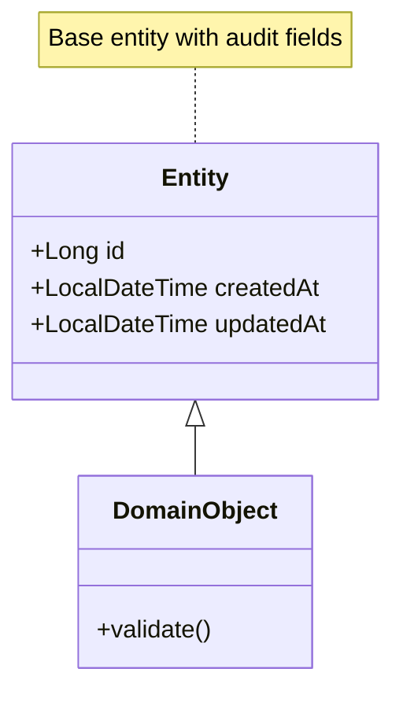

# Logical View

The Logical View describes the system's functional decomposition into packages, classes, and their relationships.

## Domain Model

## Package Structure

```mermaid
graph TB
    subgraph "Application Layer"
        CTRL[Controllers]
        DTO[DTOs]
    end
    
    subgraph "Domain Layer"
        SVC[Services]
        DOM[Domain Model]
        REPO_IF[Repository Interfaces]
    end
    
    subgraph "Infrastructure Layer"
        REPO[Repository Impl]
        CONFIG[Configuration]
        EXT[External Adapters]
    end
    
    CTRL --> SVC
    CTRL --> DTO
    SVC --> DOM
    SVC --> REPO_IF
    REPO --> REPO_IF
    REPO --> CONFIG
    
    style CTRL fill:#0f3460
    style SVC fill:#16213e
    style REPO fill:#1a1a2e
```

## Key Abstractions

| Package | Purpose | Key Classes |
|---------|---------|-------------|
| `controller` | REST endpoints | `*Controller` |
| `service` | Business logic | `*Service` |
| `repository` | Data access | `*Repository` |
| `model` | Domain entities | Entity classes |
| `dto` | Data transfer | Request/Response objects |
| `config` | Configuration | `*Config` |

## Design Patterns Used

- **Repository Pattern**: Abstracts data access
- **Service Layer**: Encapsulates business logic
- **DTO Pattern**: Separates API from domain model
- **Dependency Injection**: Loose coupling via Spring

---
*Updated by Architect agent on {{date}}*
