# Architecture Overview

This document provides a high-level overview of the system architecture using the **4+1 Architectural View Model**.

## 4+1 View Model

```mermaid
graph TB
    subgraph "+1 Scenarios"
        UC[Use Cases]
    end
    
    subgraph "Logical View"
        LV[Domain Model<br/>Classes & Packages]
    end
    
    subgraph "Development View"
        DV[Components<br/>Modules & Layers]
    end
    
    subgraph "Process View"
        PV[Runtime Behavior<br/>Concurrency]
    end
    
    subgraph "Physical View"
        PHV[Deployment<br/>Infrastructure]
    end
    
    UC --> LV
    UC --> DV
    UC --> PV
    UC --> PHV
    
    style UC fill:#e94560,color:#fff
    style LV fill:#16213e,stroke:#e94560
    style DV fill:#16213e,stroke:#e94560
    style PV fill:#16213e,stroke:#e94560
    style PHV fill:#16213e,stroke:#e94560
```

## Views

| View | Purpose | Stakeholders |
|------|---------|--------------|
| [Scenarios](scenarios.md) | Use cases that drive the architecture | All |
| [Logical](logical.md) | Functional decomposition | Designers, Developers |
| [Development](development.md) | Software organization | Developers, Managers |
| [Process](process.md) | Runtime behavior, concurrency | Integrators, Developers |
| [Physical](physical.md) | Deployment topology | DevOps, Operations |

## Architecture Decision Records

Important architectural decisions are documented as ADRs in the [adr/](adr/) directory.

---
*This architecture is maintained by the Architect agent and updated with each significant change.*
