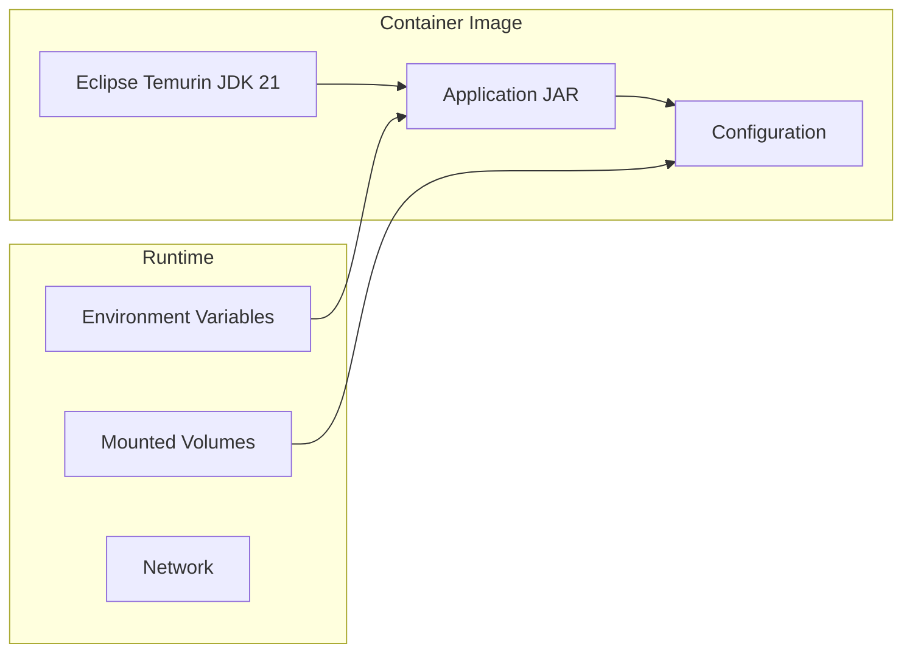

# Physical View

The Physical View describes the deployment topology and infrastructure mapping.

## Deployment Diagram

```mermaid
graph TB
    subgraph "Client Tier"
        WEB[Web Browser]
        MOB[Mobile App]
    end
    
    subgraph "Edge"
        LB[Load Balancer]
    end
    
    subgraph "Application Tier"
        subgraph "Container Orchestration"
            POD1[App Pod 1]
            POD2[App Pod 2]
            POD3[App Pod N]
        end
    end
    
    subgraph "Data Tier"
        DB[(Primary DB)]
        CACHE[(Redis Cache)]
    end
    
    WEB --> LB
    MOB --> LB
    LB --> POD1
    LB --> POD2
    LB --> POD3
    POD1 --> DB
    POD2 --> DB
    POD3 --> DB
    POD1 --> CACHE
    POD2 --> CACHE
    POD3 --> CACHE
    
    style LB fill:#e94560,color:#fff
    style POD1 fill:#16213e
    style POD2 fill:#16213e
    style POD3 fill:#16213e
    style DB fill:#0f3460
```

## Container Architecture

## Infrastructure Components

| Component | Technology | Purpose |
|-----------|------------|---------|
| Container Runtime | Docker | Application packaging |
| Orchestration | Kubernetes | Container management |
| Load Balancer | Nginx/Cloud LB | Traffic distribution |
| Database | PostgreSQL | Primary data store |
| Cache | Redis | Session/data caching |
| Monitoring | Prometheus/Grafana | Observability |

## Network Topology

```mermaid
graph TB
    subgraph "Public Network"
        INET[Internet]
    end
    
    subgraph "DMZ"
        WAF[Web Application Firewall]
        LB[Load Balancer]
    end
    
    subgraph "Private Network"
        subgraph "App Subnet"
            APP[Application Pods]
        end
        subgraph "Data Subnet"
            DB[(Database)]
        end
    end
    
    INET --> WAF
    WAF --> LB
    LB --> APP
    APP --> DB
    
    style WAF fill:#ef4444,color:#fff
    style APP fill:#16213e
    style DB fill:#0f3460
```

## Scaling Strategy

| Dimension | Strategy | Trigger |
|-----------|----------|---------|
| Horizontal | Auto-scale pods | CPU > 70% |
| Database | Read replicas | Read load |
| Cache | Cluster mode | Memory pressure |

## Environment Configuration

| Environment | Replicas | Resources | Database |
|-------------|----------|-----------|----------|
| Development | 1 | 512Mi/0.5 CPU | Local |
| Staging | 2 | 1Gi/1 CPU | Managed |
| Production | 3+ | 2Gi/2 CPU | Managed HA |

---
*Updated by Architect agent on {{date}}*
