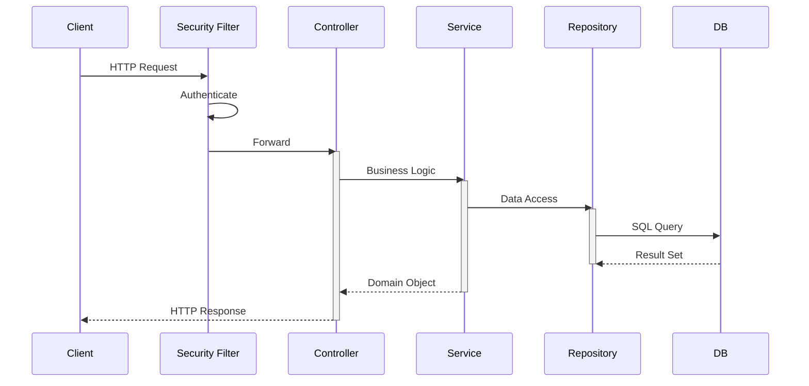
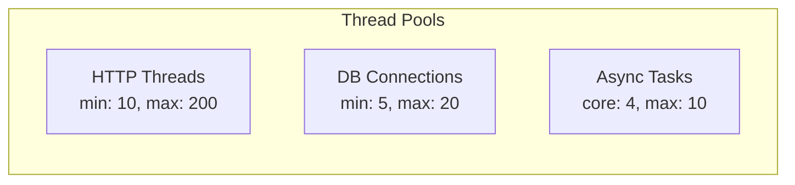

# Process View

The Process View describes the system's runtime behavior, concurrency, and dynamic interactions.

## Runtime Architecture

```mermaid
graph TB
    subgraph "Container Runtime"
        subgraph "JVM Process"
            TOM[Tomcat Thread Pool]
            MAIN[Main Thread]
            SCHED[Scheduler Threads]
        end
        
        subgraph "Spring Context"
            BEANS[Spring Beans]
            AOP[AOP Proxies]
        end
    end
    
    REQ[Incoming Request] --> TOM
    TOM --> BEANS
    BEANS --> AOP
    
    style TOM fill:#e94560,color:#fff
    style BEANS fill:#16213e
```

## Request Processing Flow

## Concurrency Model

| Component | Threading Model | Notes |
|-----------|----------------|-------|
| REST API | Thread-per-request | Tomcat thread pool |
| Services | Synchronous | Transaction bound |
| Repository | Connection pool | HikariCP |
| Scheduled Tasks | Dedicated threads | @Scheduled |

## Thread Pools

## State Management

- **Stateless Services**: No session state in service layer
- **Database Transactions**: Managed by Spring @Transactional
- **Connection Pooling**: HikariCP for efficient DB connections

## Error Handling Flow

```mermaid
graph TD
    ERR[Exception Thrown] --> GEH[Global Exception Handler]
    GEH --> LOG[Log Error]
    GEH --> RESP[Build Error Response]
    RESP --> CLIENT[Return to Client]
    
    style ERR fill:#ef4444,color:#fff
    style RESP fill:#16213e
```

---
*Updated by Architect agent on {{date}}*
