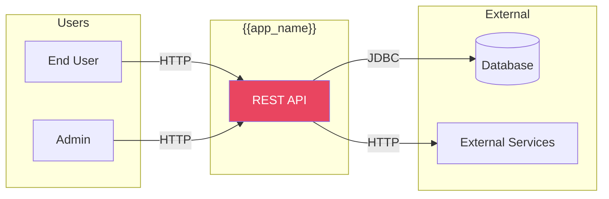
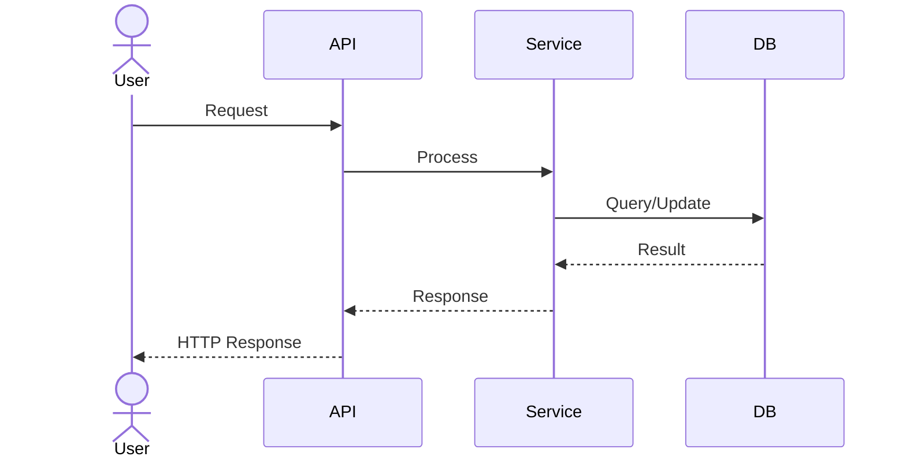

# Scenarios View (+1)

The Scenarios view captures the key use cases and user journeys that drive architectural decisions.

## System Context

## Primary Use Cases

### UC-1: [Primary Use Case Name]
**Actor:** End User  
**Description:** [Brief description of the use case]

### UC-2: [Secondary Use Case Name]
**Actor:** Admin  
**Description:** [Brief description]

## Quality Attribute Scenarios

| ID | Quality Attribute | Scenario | Response Measure |
|----|------------------|----------|------------------|
| QA-1 | Performance | Under normal load | < 200ms response |
| QA-2 | Availability | System failure | 99.9% uptime |
| QA-3 | Security | Unauthorized access | All requests authenticated |

---
*Updated by Architect agent on {{date}}*
