# ADR-0001: Initial Architecture

## Status
Accepted

## Date
{{date}}

## Context
We need to establish the initial architecture for {{app_name}}.

## Decision
We will use a **layered async architecture** with FastAPI:

```mermaid
graph TB
    subgraph "Layers"
        API[API Layer<br/>Routes, Schemas]
        BIZ[Service Layer<br/>Business Logic]
        DATA[Data Layer<br/>Repositories, ORM]
    end
    
    API --> BIZ
    BIZ --> DATA
    
    style API fill:#e94560,color:#fff
    style BIZ fill:#16213e
    style DATA fill:#0f3460
```

### Key Decisions:
1. **FastAPI** for async web framework
2. **Pydantic** for data validation
3. **SQLAlchemy 2.0** with async support
4. **PostgreSQL** as primary database
5. **Docker** for containerization

## Consequences

### Positive
- High performance with async I/O
- Automatic OpenAPI documentation
- Strong type validation
- Modern Python patterns

### Negative
- Async complexity for simple operations
- Learning curve for async patterns

## References
- [FastAPI Documentation](https://fastapi.tiangolo.com/)
- [SQLAlchemy Async](https://docs.sqlalchemy.org/en/20/orm/extensions/asyncio.html)
