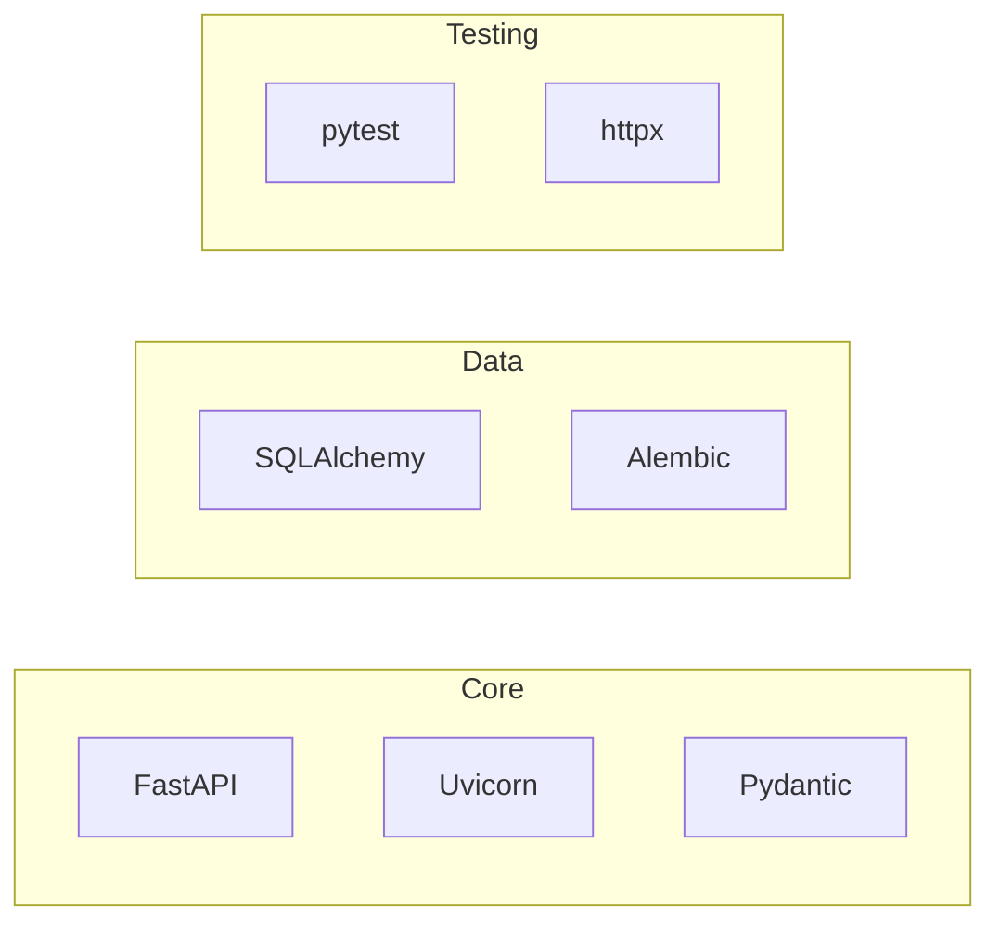

# Development View

The Development View describes the system's organization from a developer's perspective.

## Component Diagram

```mermaid
graph TB
    subgraph "{{app_name}}"
        subgraph "API Layer"
            FAST[FastAPI App]
            MW[Middleware]
        end
        
        subgraph "Business Layer"
            SVC[Services]
            VAL[Validators]
        end
        
        subgraph "Data Layer"
            REPO[Repositories]
            ORM[SQLAlchemy]
        end
    end
    
    FAST --> MW
    FAST --> SVC
    SVC --> VAL
    SVC --> REPO
    REPO --> ORM
    
    style FAST fill:#e94560,color:#fff
    style SVC fill:#16213e
    style REPO fill:#0f3460
```



## Project Structure

```
{{app_name}}/
├── src/
│   └── {{package}}/
│       ├── api/
│       │   ├── routes/          # API endpoints
│       │   └── deps.py          # Dependencies
│       ├── core/
│       │   ├── config.py        # Settings
│       │   └── security.py      # Auth
│       ├── models/              # Pydantic models
│       ├── schemas/             # API schemas
│       ├── services/            # Business logic
│       ├── repositories/        # Data access
│       └── main.py              # App entry
├── tests/                       # Test suite
├── docs/
│   └── architecture/            # Arch docs
├── pyproject.toml               # Dependencies
└── Dockerfile                   # Container
```

## Dependencies



## Build Pipeline

| Stage | Tool | Command |
|-------|------|---------|
| Lint | Ruff | `ruff check .` |
| Format | Black | `black .` |
| Type Check | mypy | `mypy src` |
| Test | pytest | `pytest` |
| Build | Docker | `docker build` |

---
*Updated by Architect agent on {{date}}*
