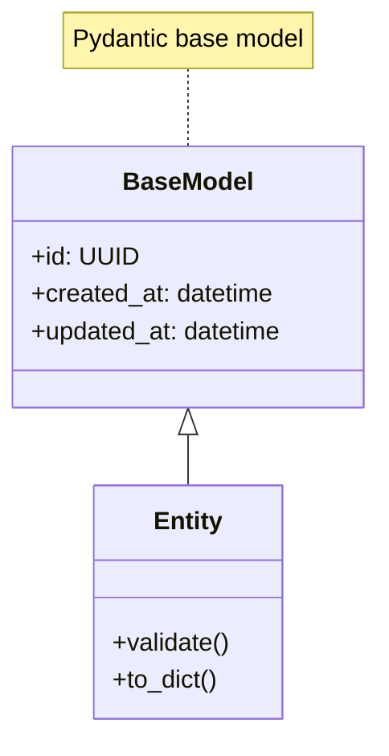

# Logical View

The Logical View describes the system's functional decomposition into modules, classes, and their relationships.

## Domain Model

## Module Structure

```mermaid
graph TB
    subgraph "API Layer"
        ROUTES[Routers]
        SCHEMAS[Pydantic Schemas]
        DEPS[Dependencies]
    end
    
    subgraph "Service Layer"
        SVC[Services]
        DOM[Domain Models]
    end
    
    subgraph "Data Layer"
        REPO[Repositories]
        ORM[SQLAlchemy Models]
    end
    
    ROUTES --> SVC
    ROUTES --> SCHEMAS
    ROUTES --> DEPS
    SVC --> DOM
    SVC --> REPO
    REPO --> ORM
    
    style ROUTES fill:#0f3460
    style SVC fill:#16213e
    style REPO fill:#1a1a2e
```

## Key Abstractions

| Module | Purpose | Key Classes |
|--------|---------|-------------|
| `api/routes` | REST endpoints | Router functions |
| `services` | Business logic | Service classes |
| `repositories` | Data access | Repository classes |
| `models` | Domain entities | Pydantic models |
| `schemas` | API contracts | Request/Response |
| `core` | Configuration | Settings, deps |

## Design Patterns Used

- **Repository Pattern**: Abstracts data access
- **Dependency Injection**: FastAPI Depends()
- **Pydantic Models**: Data validation
- **Async/Await**: Non-blocking I/O

---
*Updated by Architect agent on {{date}}*
