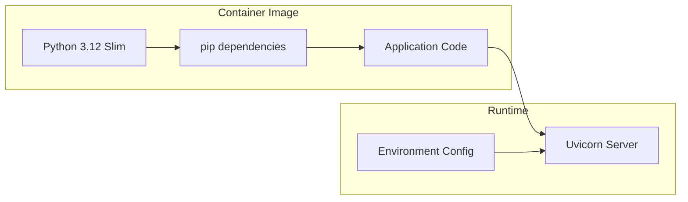

# Physical View

The Physical View describes the deployment topology and infrastructure mapping.

## Deployment Diagram

```mermaid
graph TB
    subgraph "Client Tier"
        WEB[Web Browser]
        MOB[Mobile App]
    end
    
    subgraph "Edge"
        LB[Load Balancer]
    end
    
    subgraph "Application Tier"
        subgraph "Container Orchestration"
            POD1[FastAPI Pod 1]
            POD2[FastAPI Pod 2]
            POD3[FastAPI Pod N]
        end
    end
    
    subgraph "Data Tier"
        DB[(PostgreSQL)]
        CACHE[(Redis)]
    end
    
    WEB --> LB
    MOB --> LB
    LB --> POD1
    LB --> POD2
    LB --> POD3
    POD1 --> DB
    POD2 --> DB
    POD3 --> DB
    POD1 --> CACHE
    
    style LB fill:#e94560,color:#fff
    style POD1 fill:#16213e
    style POD2 fill:#16213e
    style POD3 fill:#16213e
    style DB fill:#0f3460
```

## Container Architecture

## Infrastructure Components

| Component | Technology | Purpose |
|-----------|------------|---------|
| Runtime | Python 3.12 | Application runtime |
| Server | Uvicorn | ASGI server |
| Container | Docker | Packaging |
| Orchestration | Kubernetes | Management |
| Database | PostgreSQL | Primary store |
| Cache | Redis | Caching |

## Network Topology

```mermaid
graph TB
    subgraph "Public"
        INET[Internet]
    end
    
    subgraph "DMZ"
        LB[Load Balancer]
    end
    
    subgraph "Private"
        APP[App Pods]
        DB[(Database)]
    end
    
    INET --> LB
    LB --> APP
    APP --> DB
    
    style LB fill:#e94560,color:#fff
    style APP fill:#16213e
```

## Scaling Strategy

| Dimension | Strategy | Trigger |
|-----------|----------|---------|
| Horizontal | HPA | CPU > 70% |
| Database | Read replicas | Read load |
| Cache | Cluster | Memory |

---
*Updated by Architect agent on {{date}}*
