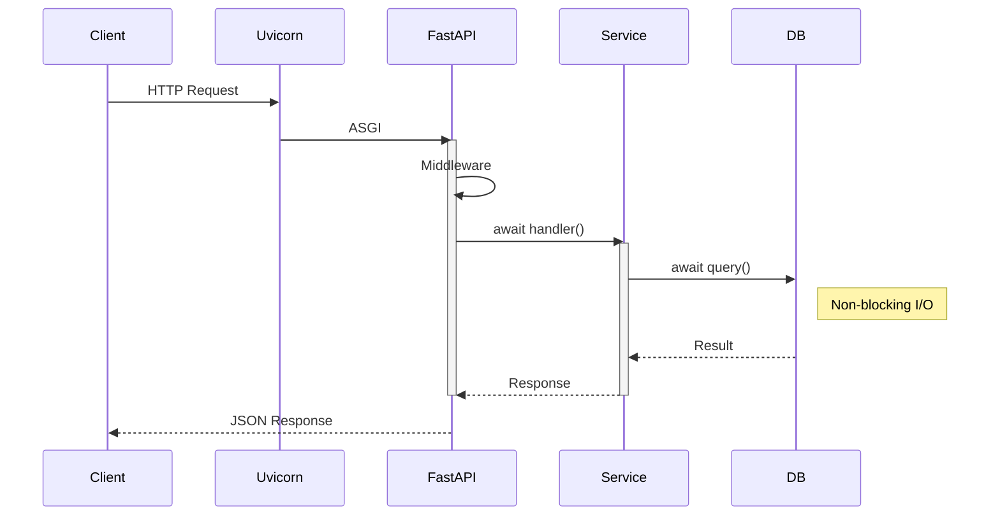
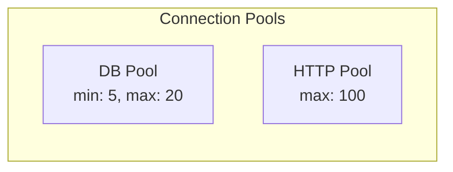
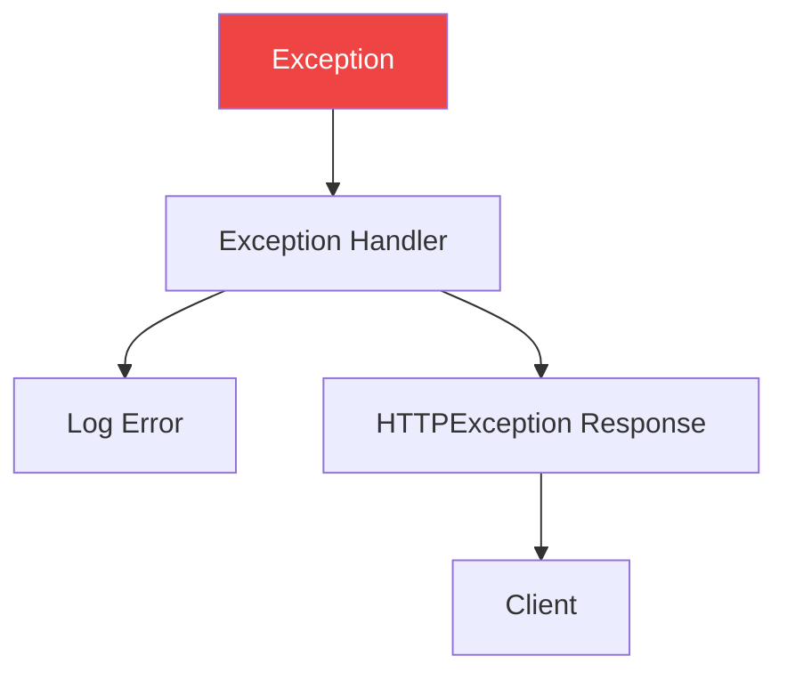

# Process View

The Process View describes the system's runtime behavior, async patterns, and concurrency.

## Runtime Architecture

```mermaid
graph TB
    subgraph "Container"
        subgraph "Uvicorn Process"
            LOOP[Event Loop]
            WORKERS[Worker Tasks]
        end
        
        subgraph "FastAPI App"
            ROUTES[Route Handlers]
            MW[Middleware Stack]
            DEPS[Dependency Graph]
        end
    end
    
    REQ[Request] --> LOOP
    LOOP --> MW
    MW --> ROUTES
    ROUTES --> DEPS
    
    style LOOP fill:#e94560,color:#fff
    style ROUTES fill:#16213e
```

## Async Request Flow

## Concurrency Model

| Component | Model | Notes |
|-----------|-------|-------|
| Uvicorn | asyncio event loop | Single process, async |
| Route handlers | async/await | Non-blocking |
| DB operations | async drivers | asyncpg/aiosqlite |
| External calls | httpx async | Non-blocking HTTP |

## Connection Pools

## Middleware Stack

```mermaid
graph TD
    REQ[Request] --> CORS[CORS Middleware]
    CORS --> AUTH[Auth Middleware]
    AUTH --> LOG[Logging Middleware]
    LOG --> ROUTE[Route Handler]
    ROUTE --> RESP[Response]
    
    style REQ fill:#e94560,color:#fff
    style ROUTE fill:#16213e
```

## Error Handling

---
*Updated by Architect agent on {{date}}*
